# Simple Twitter

- 這是 alphaCamp 學期３作業 以前後分離的狀態下製作出簡易版的社群平台 在這個實作下學習到串接 API 時與後端即時溝通與資料規格上的討論，在技術上是以 React 環境，熟悉 JSX、SCSS、react-hook...等的使用方式

## Features 功能

- 前台登入 帳號：user1 密碼：12345678
  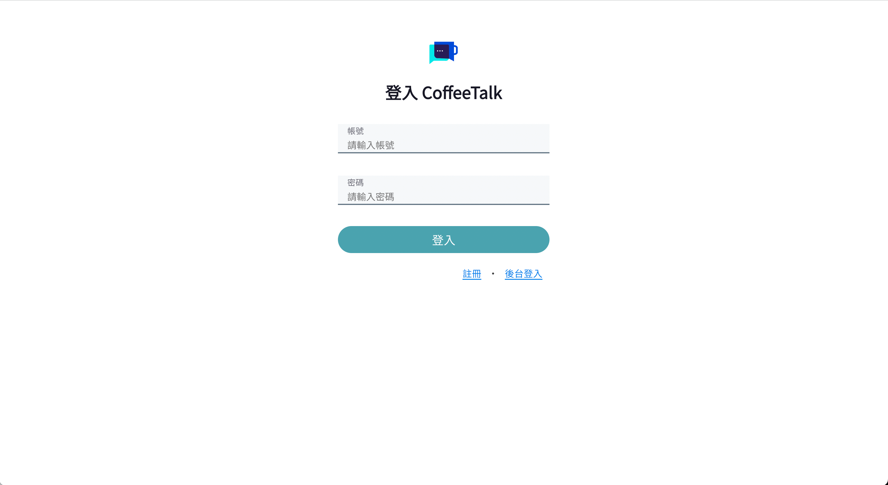

- 可以註冊自己的帳號，到前台登入（註冊的帳號無法到後台登入）
  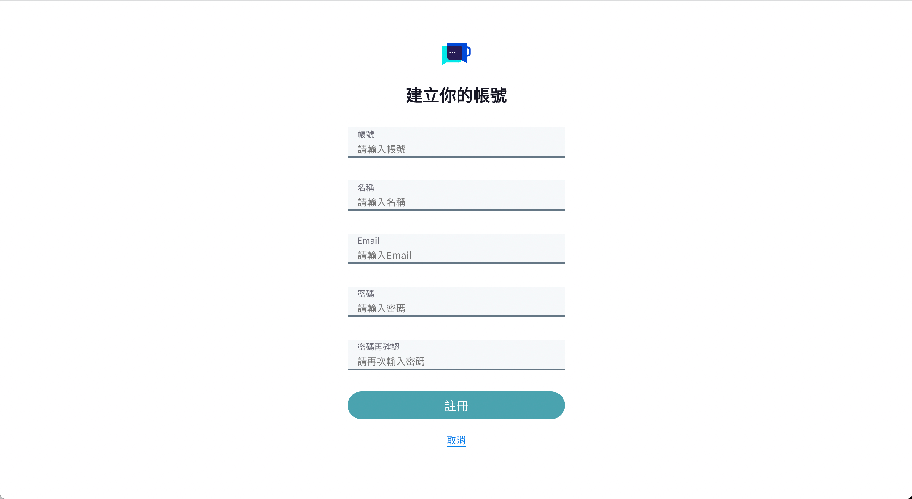

- 後台登入 帳號：root 密碼：12345678
  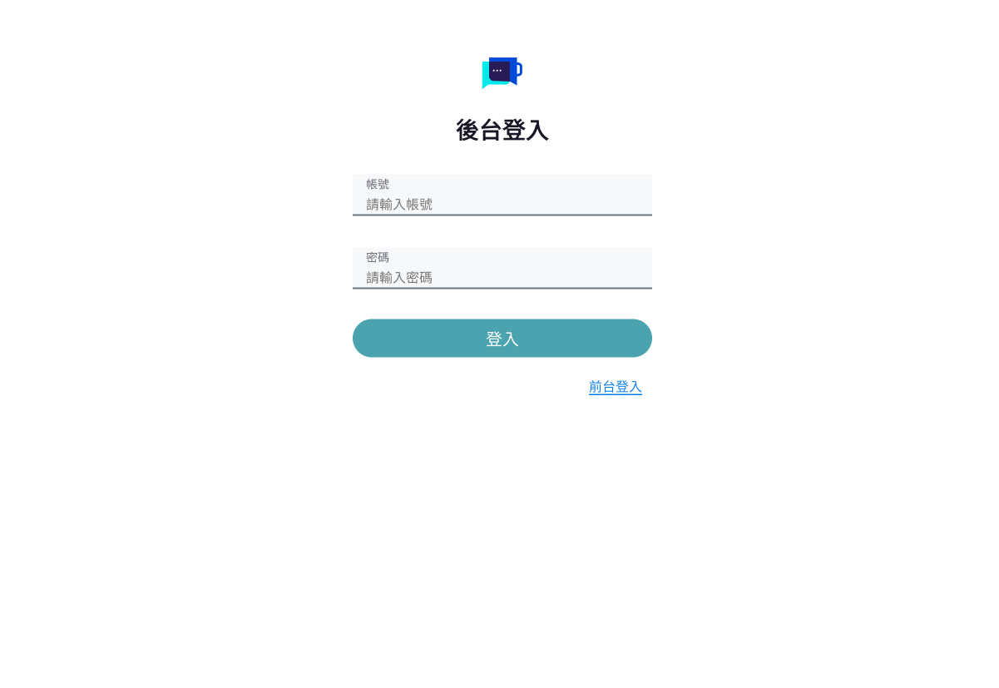

- 首頁畫面
  

- 可以撰寫推文按下推文按鈕後建立新的貼文
  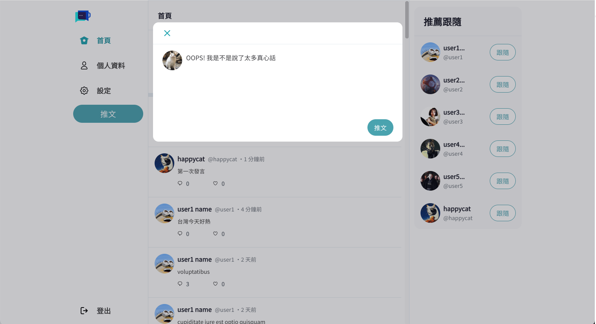

- 點選回覆圖示對推文進行回覆
  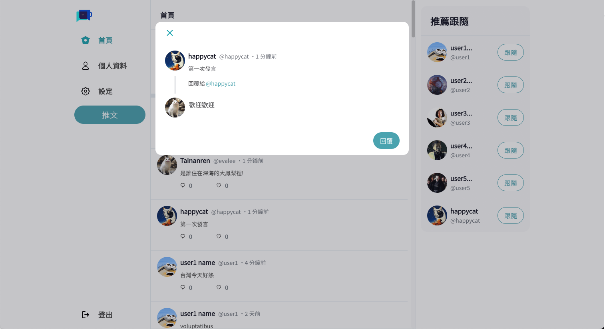

- 點選愛心圖示喜歡推文
  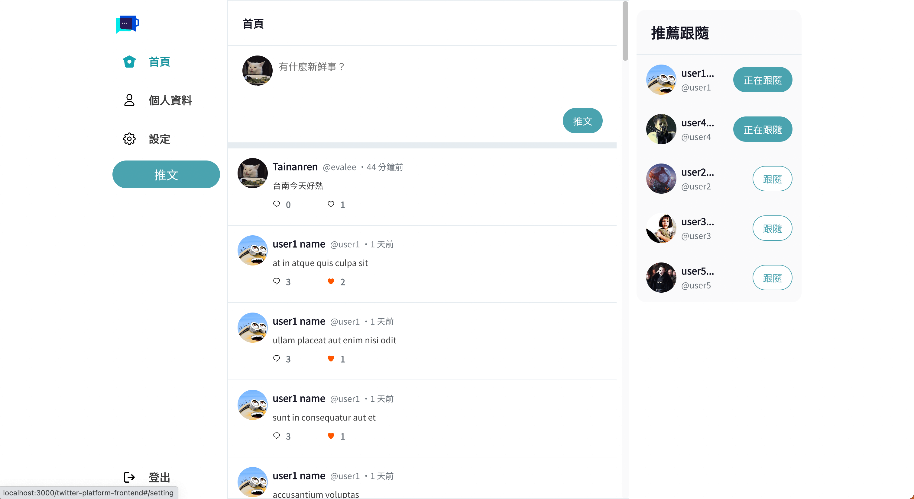

- 點選用戶頭像看到相關資訊以及該用戶的推文、回覆、喜歡
  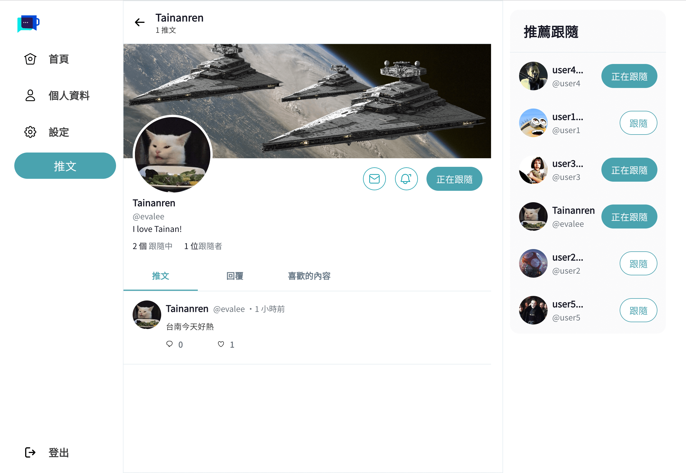

- 點選跟隨按鈕建立追蹤該用戶
  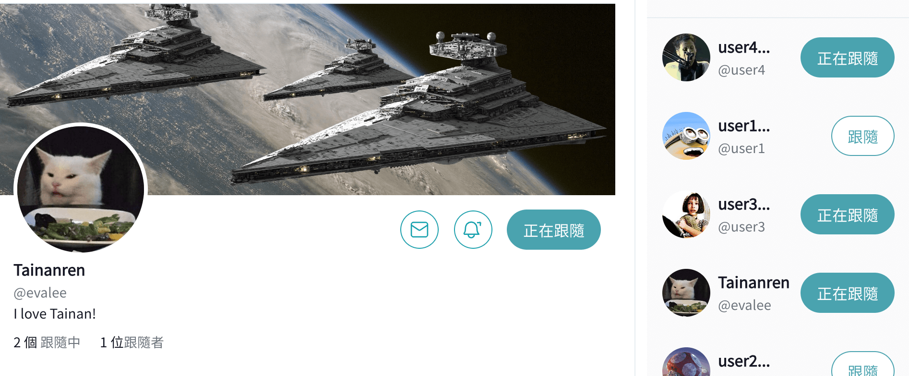

- 點擊跟隨中或跟隨者查看目前跟隨者與正在跟隨列表
  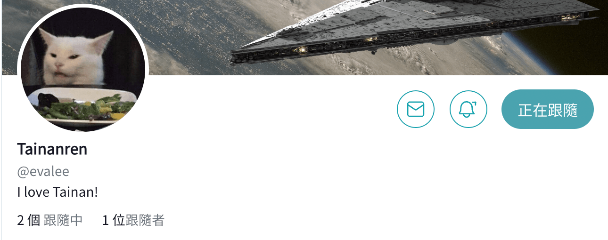

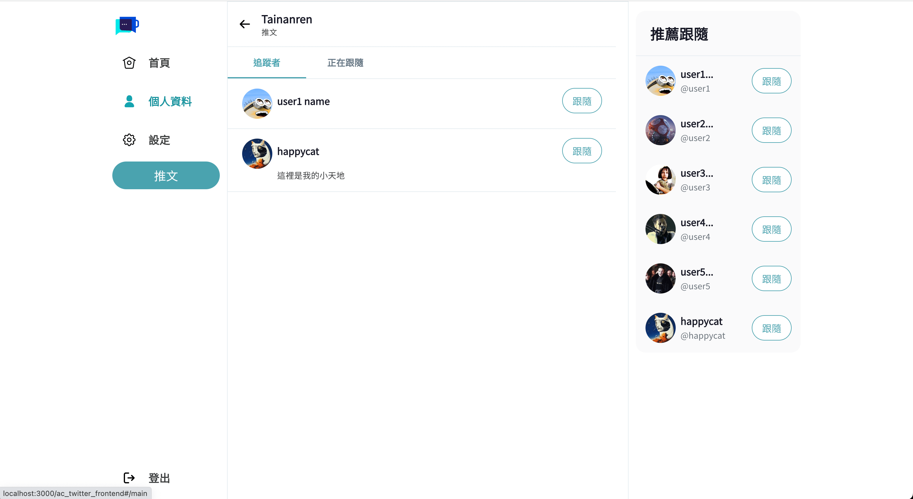

- 在個人資料點選編輯個人資料，可修改頭像、背景、名稱、自我介紹
  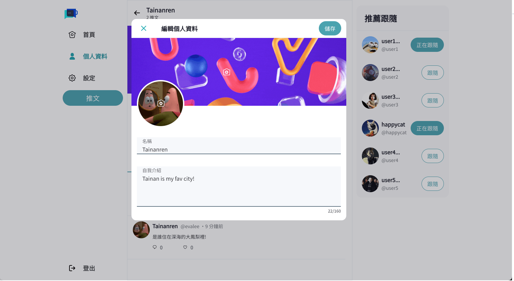

- 點選右側設定欄，可修改帳號、email、密碼
  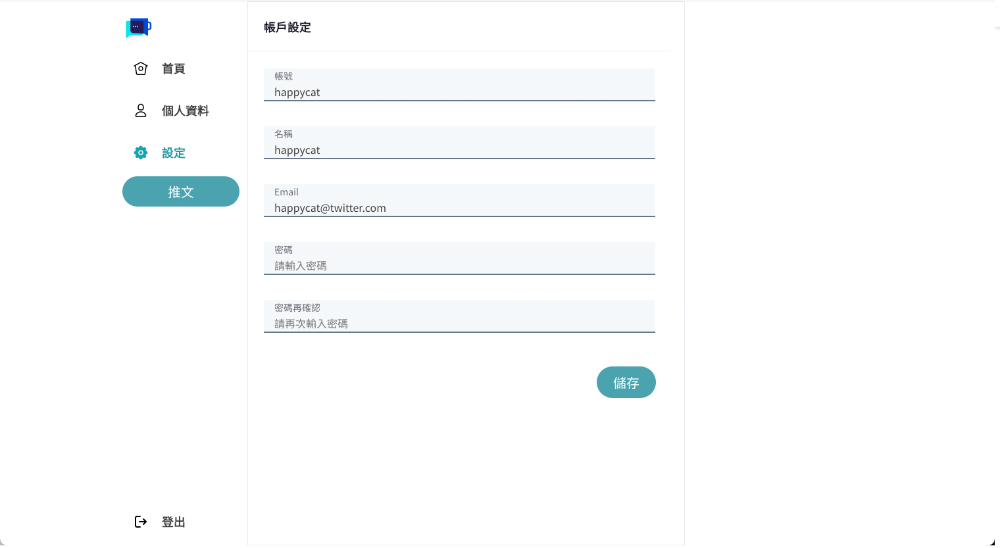

- 後台推文清單查看所有推文
  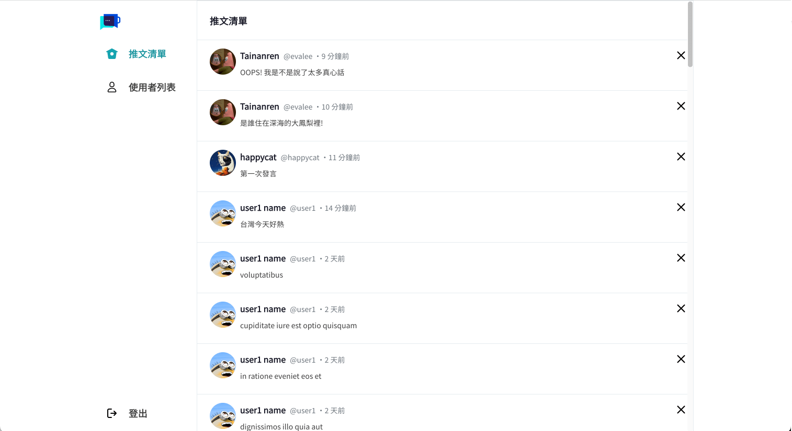

- 點選 x 圖示刪除推文
<!--  -->

- 後台使用者列表可看到所有用戶
  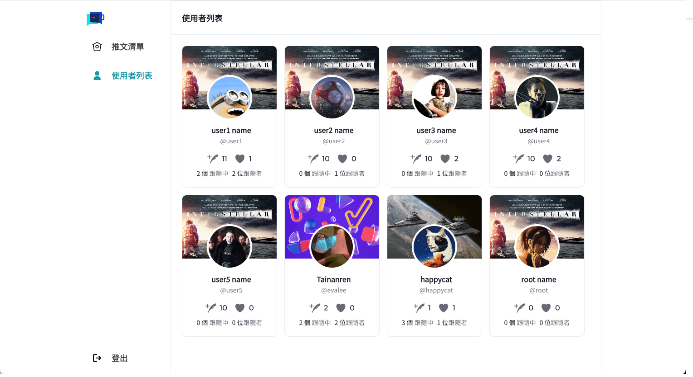

## Prerequisites

- Node.js 14.16.0
- react 18.2.0
- sass 1.62.1

## Other Dependencies

- axios 0.27.2
- bootstrap 5.3.0
- dayjs 1.11.8
- clsx 1.2.1
- gh-pages 4.0.0
- sweetalert2 11.7.12
- jsonwebtoken 9.0.0
- react-hook-form 7.44.3

## Install and Execution

1. 請確認有無下載 Node.js 和 npm
2. 將專案 clone 到本地，在終端機入以下指令
   `git clone https://github.com/leemengyun/ac_twitter_frontend.git`
3. 安裝 node_modules，在終端機輸入以下指令
   `npm install`
4. 在終端機輸入以下指令，開啟專案
   `npm start`
5. 打開瀏覽器輸入 http://localhost:3000/#/login，便可看到登入畫面
6. 使用的帳號進入前台或後台

- 前台登入 帳號：user1 密碼：12345678
- 後台登入 帳號：root 密碼：12345678

7. 預想停止，在終端機輸入以下指令
   `ctrl+c`

## Project Team Members

前端 - Eva Lee, Keifer
後端 - Sam Lu, 林哲哲
